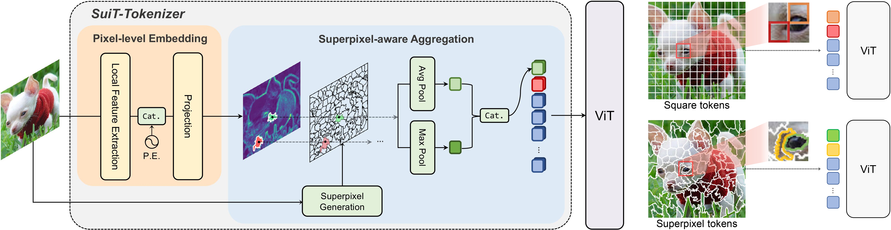
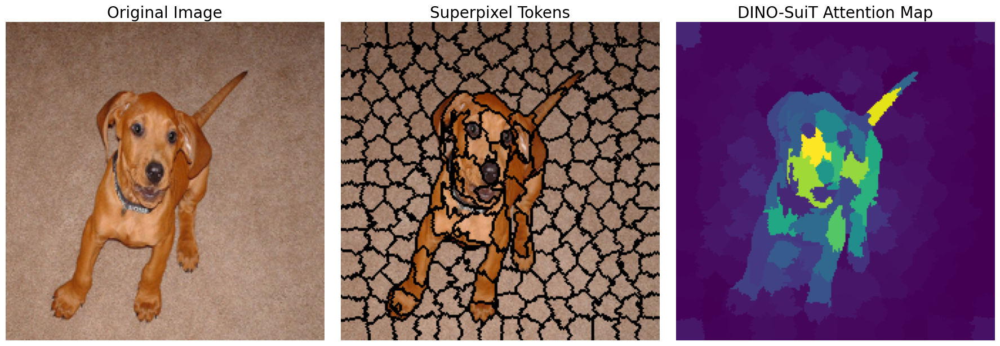

<p align="center">
  <h1 align="center">
    (SuiT) Superpixel Tokenization for Vision Transformers: Preserving Semantic Integrity in Visual Tokens
    <a href="https://arxiv.org/abs/2412.04680">
      
    </a>
  </h1>
</p>
<p align="center">
  <a href="https://scholar.google.com/citations?user=LeF2vTkAAAAJ&hl=ko&oi=sra"><strong>Jaihyun Lew*</strong></a> ·
  <a href="https://scholar.google.com/citations?hl=ko&user=--GPDZgAAAAJ"><strong>Soohyuk Jang*</strong></a> ·
  <a href="https://scholar.google.com/citations?hl=ko&user=jrEMx68AAAAJ"><strong>Jaehoon Lee*</strong></a> ·
  <a href="https://scholar.google.co.kr/citations?user=NmAwtsIAAAAJ&hl=ko"><strong>Seungryong Yoo</strong></a> ·
  <a href="https://scholar.google.com/citations?user=nShf6cgAAAAJ&hl=ko&oi=sra"><strong>Eunji Kim</strong></a> <br>
  <a href="https://scholar.google.com/citations?user=nS24h74AAAAJ&hl=ko&oi=sra"><strong>Saehyung Lee</strong></a> ·
  <a href="https://scholar.google.com/citations?user=LZP5k2cAAAAJ&hl=ko&oi=sra"><strong>Jisoo Mok</strong></a> ·
  <a href="https://scholar.google.com/citations?user=xMRzdH0AAAAJ&hl=ko&oi=sra"><strong>Siwon Kim</strong></a> ·
  <a href="https://scholar.google.com/citations?user=Bphl_fIAAAAJ&hl=ko&oi=sra"><strong>Sungroh Yoon</strong></a>
</p>

<a href="">
  
</a>
<br><br>
<p align="center">
  
</p>

<p>
🔥 In this work, we propose a <strong>novel tokenization pipeline</strong> that replaces the grid-based tokenization with <strong>superpixels</strong>, encouraging each token to capture a <strong>distinct visual concept</strong>. Unlike square image patches, superpixels are formed in varying shapes, sizes, and locations, making direct substitution challenging. To address this, our pipeline first generates pixel-level embeddings and efficiently aggregates them within superpixel clusters, producing <strong>superpixel tokens</strong> that seamlessly replace patch tokens in ViT.
</p>
  
## Environmental Setup
To set up the environment, run the following commands:
```bash
git clone https://github.com/jangsoohyuk/SuiT.git
cd SuiT
conda create -n suit python=3.10 -y
conda activate suit
conda install pytorch==2.1.0 torchvision==0.16.0 torchaudio==2.1.0 pytorch-cuda=12.1 -c pytorch -c nvidia -y
pip install torch_scatter-2.1.2+pt21cu121-cp310-cp310-linux_x86_64.whl
pip install -r requirements.txt
```

## Structure
The dataset directory should be structured as follows:
```
    datasets/

    └── imagenet-1k/
```
- checkpoint files are saved at `./outputs`
- logs are saved under `./logs`


## Training
To train our model, run the corresponding bash script based on the model size.
For example, to train <strong>SuiT-Base</strong> on ImageNet-1k, run the following command:
```bash
bash scripts/train_base.sh
```

## Evaluation 
To evaluate a pre-trained model, run the following command:
```bash
bash scripts/eval.sh
```

## Pretrained weights
Pretrained models can be downloaded [here](https://drive.google.com/drive/folders/1Y0mOqErAiOkTQJ7TTDf4ClWMZXsv9Cqg?usp=sharing).

## Attention Map Visualization
You can visualize the generated superpixels and self-attention maps using the jupyter notebook file, ```attention_visualization.ipynb```.

## Acknowledgment
This repository is based on the original [DEiT repository](https://github.com/facebookresearch/deit).  
We sincerely thank the authors for their great work.
